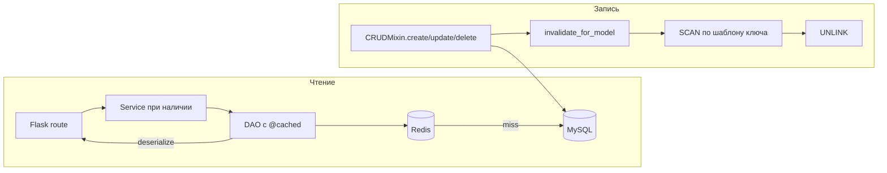

# Материал для защиты: многоуровневое кэширование (Redis) в mini-shop-server

Документ составлен так, чтобы **отвечать по пунктам**: что требовалось по лабораторной / проекту, что реализовано, **как** и **где в коде**. В конце — типичные вопросы преподавателя с краткими ответами.

---

## 1. Что обычно требуется в таком задании (чеклист)

Ниже — обобщённая формулировка типичного проекта (лаб. 5 / курсовой фрагмент по кэшированию). Отметки **«+»** — реализовано в текущем репозитории.

| № | Требование | Статус | Где смотреть в проекте |
|---|------------|--------|------------------------|
| 1 | Подключить Redis, конфигурация хоста/порта/TTL, возможность отключить кэш | + | `app/config/setting.py`, `app/config/secure.py` (`REDIS_PASSWORD`), `app/core/cache.py` → `init_cache` |
| 2 | Кэшировать чтение «горячих» сущностей: товары, категории, баннеры, данные пользователя для auth | + | `app/dao/product.py`, `app/dao/category.py`, `app/dao/banner.py`, `app/dao/user.py`, `app/core/token_auth.py` |
| 3 | Единый формат ключей, разные TTL для разных типов данных | + | префиксы в декораторе `@cached`, карта `CACHE_TTL` в `app/config/setting.py` |
| 4 | Инвалидация при изменении данных (не показывать устаревшее после write) | + | `app/core/db.py` (`CRUDMixin` / `BaseModel`), `invalidate_for_model` и `MODEL_PREFIX_MAP` в `app/core/cache.py` |
| 5 | Защита от «пробоя кэша» (cache stampede): много одновременных запросов на один холодный ключ | + | `cache_service.single_flight` + короткое ожидание значения в `@cached`: `app/core/cache.py` |
| 6 | Прогрев кэша при старте (опционально, для снижения первых промахов) | + | `app/core/cache_warmer.py`, вызов из `apply_cache` в `app/__init__.py` |
| 7 | Мониторинг / метрики (hit/miss, диагностика) | + | счётчики в Redis, сводка `cache_info_summary`, CMS API `app/api/cms/cache.py` |
| 8 | Тесты (юнит без Redis и/или интеграция с Redis) | + | `tests/test_cache_unit.py`, `tests/test_cache_integration.py` |
| 9 | Доказательство ускорения (например, ≥50% по времени ответа на кэшируемый путь) | + | `tools/bench_cache.py`, визуализация `tools/bench_cache_plot.py`, выход в `tools/bench_output/` |

Если преподаватель использует **другую нумерацию** в своём листе задания — просто сопоставьте строки таблицы с его пунктами: смысл тот же (Redis, ключи, TTL, инвалидация, надёжность, тесты, замеры).

---

## 2. Общая идея решения (одним абзацем)

Чтение частых API-запросов переведено на путь **«сначала Redis, при промахе — MySQL, результат сериализуется в JSON и кладётся в Redis с TTL»**. Запись в БД через ORM-миксины **после успешного commit** запускает **групповую инвалидацию** связанных префиксов через **`SCAN` + `UNLINK`** (без блокирующего `KEYS *`). При недоступности Redis слой **не ломает запросы** — выполняется прямой запрос к БД (graceful degradation). Дополнительно: **single-flight** при пересборке «холодного» ключа, **прогрев** горячих read-path при старте, **CMS-эндпоинты** для статистики и ручной очистки.

---

## 3. Архитектура по слоям (как в проекте)

Соблюдена существующая схема: **API → service → DAO → models**.

- **Интеграция кэша** сделана в основном на **DAO** (методы чтения), плюс **кэширование lookup пользователя** в **token_auth** (чтобы не дергать БД на каждый защищённый запрос).
- **Инвалидация** — на уровне **базы / mixin’ов моделей** (`CRUDMixin`), чтобы любой код, меняющий сущность через эти методы, автоматически чистил кэш.



---

## 4. Конфигурация Redis и кэша

**Файл:** `app/config/setting.py`

Там заданы:

- `CACHE_ENABLED`, `CACHE_KEY_PREFIX` (по умолчанию `ms`);
- `REDIS_HOST`, `REDIS_PORT`, `REDIS_DB`, таймауты сокета;
- `CACHE_TTL` — словарь TTL (секунды) по логическим префиксам: `product:list`, `product:detail`, `product:recent`, `category:*`, `banner:detail`, `user:by_id` и т.д.;
- `CACHE_STAMPEDE_LOCK_TTL` — TTL блокировки single-flight;
- `CACHE_WARMUP_ENABLED` — включение прогрева;
- в список `ALL_RP_API_LIST` добавлен модуль **`cms-cache`**, чтобы эндпоинты админ-статистики попали в Swagger.

**Пароль Redis (если нужен):** `app/config/secure.py` → `REDIS_PASSWORD` (в репозитории по умолчанию `None`).

**Инициализация при старте приложения:** `app/__init__.py`  
Функция `register_plugin` вызывает `apply_cache(app)` → `init_cache(app)` и при включённом прогреве — `warm_cache(app)`.

---

## 5. Ядро кэша: ключи, сериализация, метрики, инвалидация

**Файл:** `app/core/cache.py`

### 5.1. Соглашение о ключах

- Базовый префикс приложения: **`ms`** (из `CACHE_KEY_PREFIX`).
- Логический префикс операции задаётся в декораторе, например `product:detail`, `category:list`.
- Суффикс строится из аргументов функции (`_build_default_key`) либо явным **`key_builder`** в `@cached`.
- Итоговый ключ в Redis обычно выглядит как  
  **`ms:<entity>:<op>:<нормализованные_аргументы>`**  
  (подробности нормализации — в `_normalize_arg` / `_build_default_key`).

### 5.2. Сериализация в JSON

- Используется `json.dumps` с **`_json_default`**, который понимает модели с **`JSONSerializerMixin`** (как в проекте), а также `datetime` / `date`.

### 5.3. Декоратор `@cached`

**Сигнатура и поведение** — в функции `cached(...)` в том же файле:

- при **hit** — десериализация JSON и инкремент метрики **hits**;
- при **miss** — инкремент **misses**, вычисление TTL:
  - либо число,
  - либо **callable `ttl(*args, **kwargs)`** (используется для «горячих» товаров),
  - либо значение из `CACHE_TTL[prefix]`;
- при **single-flight** (`stampede_lock=True`):
  - один «победитель» пересчитывает значение и пишет в Redis;
  - остальные **коротко ждут** появления ключа (см. цикл с `deadline`), затем при отсутствии значения идут в БД — это уменьшает **thundering herd** по сравнению с мгновенным обходом кэша всеми потоками.

### 5.4. Инвалидация: `MODEL_PREFIX_MAP` и `invalidate_for_model`

**Словарь** `MODEL_PREFIX_MAP` в `app/core/cache.py` сопоставляет **имя класса модели** (строка) со **списком шаблонов** ключей для удаления:

- `Product` → `product:*`
- `Category` → `category:*` и **`product:list:*`** (категория влияет на выборки товаров)
- `Banner`, `BannerItem` → `banner:*`
- `User` → `user:by_id:*`, с уточнением до конкретного id при переданном `instance`

Удаление по шаблону реализовано в `CacheService` (поиск через **SCAN**, удаление **UNLINK** / аналогично по возможностям клиента).

### 5.5. Graceful degradation

Любая ошибка Redis внутри декоратора логируется, после чего выполняется **исходная функция** (запрос к БД). То же — при отключённом кэше (`CACHE_ENABLED=False` или клиент не поднялся).

---

## 6. Где именно кэшируются чтения (DAO и auth)

| Область | Файл | Что кэшируется |
|--------|------|----------------|
| Товары | `app/dao/product.py` | недавние, карточка по id, список по категории; для `get_most_recent` — **динамический TTL** (короткий / длинный для «топ-10») |
| Категории | `app/dao/category.py` | все / список / по id |
| Баннеры | `app/dao/banner.py` | активный баннер по id |
| Пользователь (auth) | `app/dao/user.py` + `app/core/token_auth.py` | `get_for_auth(uid)` — примитивный dict, в `g.user` оборачивается в `SimpleNamespace` |

**Маршруты v1**, которые этим пользуются (кэш «прозрачен» для клиента):  
`app/api/v1/category.py`, `app/api/v1/banner.py` — логика чтения переведена на DAO-методы с `@cached`.

---

## 7. Инвалидация при записи в БД

**Файл:** `app/core/db.py`

- Функция **`_invalidate_cache`** лениво импортирует `invalidate_for_model`, чтобы не плодить циклические импорты с `cache.py`.
- Вызывается из **`CRUDMixin.create` / `update` / `delete` / `hard_delete`** после успешного **`commit=True`**, а также из **`BaseModel.delete`** (если используется этот путь).

**Важно для защиты:** инвалидация привязана к **типичным ORM-операциям проекта**. Если где-то данные меняются **сырым SQL** или в обход mixin’ов — кэш нужно чистить отдельно (ручной flush из CMS или доработка кода).

---

## 8. Прогрев кэша (warm-up)

**Файл:** `app/core/cache_warmer.py`

При старте (если кэш включён и `CACHE_WARMUP_ENABLED`):

- в **`app.test_request_context('/')`** вызываются горячие DAO-методы (товары top-10, все категории, баннер id=1), чтобы модели с URL-зависимыми свойствами не падали;
- используется **`warmup_guard`** (лок в памяти процесса), чтобы не гонять прогрев параллельно в одном процессе.

Ошибки прогрева **не роняют** приложение — пишутся в лог.

---

## 9. Мониторинг и админ-API (CMS)

**Реализация:** `app/api/cms/cache.py`  
**Swagger-описание:** `app/extensions/api_docs/cms/cache.py`

Эндпоинты (требуют **admin** токен):

| Метод | Путь | Назначение |
|-------|------|------------|
| GET | `/cms/cache/stats` | hit/miss/error, ключи по префиксам, память Redis, копия `MODEL_PREFIX_MAP` |
| POST | `/cms/cache/flush?prefix=...` | сброс по префиксу; пустой prefix — весь namespace; внутри SCAN+UNLINK |
| POST | `/cms/cache/metrics/reset` | сброс счётчиков метрик |

---

## 10. Тестирование

| Файл | Назначение |
|------|------------|
| `tests/test_cache_unit.py` | `fakeredis`: `@cached`, метрики, инвалидация, single-flight, callable TTL |
| `tests/test_cache_integration.py` | живой Redis (пропуск, если недоступен); flush, CMS flush, отключение кэша |

Запуск:

```bash
uv run pytest tests/test_cache_unit.py tests/test_cache_integration.py
```

---

## 11. Доказательство ускорения (для критерия «≥50%»)

**Скрипт:** `tools/bench_cache.py`  
Сравнивает **cold** (каждый раз сброс namespace перед одним вызовом) и **warm** (много повторов с уже заполненным кэшем), печатает p50/p95 и **код выхода 0**, если ускорение по p50 ≥ 50%.

**Графики:** `tools/bench_cache_plot.py` → PNG + JSON в каталоге `tools/bench_output/`.

Примеры команд:

```bash
uv run python tools/bench_cache.py --target category:list --iterations 50
uv run python tools/bench_cache.py --target product:recent --count 10
uv run python tools/bench_cache.py --target synthetic --fakeredis
uv run python tools/bench_cache_plot.py --targets category:list product:recent synthetic
```

Конкретные цифры зависят от машины, Docker MySQL/Redis и объёма данных — для отчёта приложите **свежий** вывод скрипта и/или скриншоты из `tools/bench_output/`.

---

## 12. Документация в репозитории

- **Для агентов / среды:** `AGENTS.md` — раздел про Redis и бенчмарк.
- **Для пользователей проекта:** `README.md` — раздел «Кэширование (Redis)», таблицы TTL и админ-эндпоинтов.

---

## 13. Вопросы преподавателя (краткие ответы)

**Почему кэш в DAO, а не в Flask-route?**  
Чтобы переиспользовать одни и те же запросы из разных эндпоинтов и не дублировать логику; ближе к данным и проще согласовать ключи с реальными аргументами SQL.

**Что будет, если Redis упал?**  
`@cached` поймает ошибку и выполнит функцию — запрос пойдёт в MySQL; ответ клиенту не ломается.

**Как вы гарантируете, что после UPDATE не отдаётся старое?**  
После `commit` дергается `invalidate_for_model` → удаление ключей по шаблонам из `MODEL_PREFIX_MAP`.

**Почему нельзя `KEYS *`?**  
На больших базах Redis это блокирует сервер; используется инкрементальный **SCAN**.

**Что такое cache stampede и что сделано?**  
Многие клиенты одновременно промахиваются в кэш; без защиты все идут в БД. Здесь — **single-flight lock** + короткое **ожидание** записи победителем.

**Почему у Category инвалидируется ещё `product:list`?**  
Потому что списки товаров по категории зависят от атрибутов категории; иначе возможны «фантомные» списки.

**Как вы измеряли ускорение?**  
Скрипт `tools/bench_cache.py` (cold vs warm, p50/p95); для отчёта — `tools/bench_cache_plot.py`.

**Где настройка TTL для «горячих» товаров?**  
В `ProductDao.get_most_recent` передан **callable TTL**; порог и длительности завязаны на `CACHE_TTL` (`product:recent` vs `product:hot`) и логике в DAO / `_resolve_ttl` в `cache.py`.

---

## 14. Быстрая навигация по файлам (шпаргалка)

| Назначение | Путь |
|------------|------|
| Настройки Redis / TTL / флаги | `app/config/setting.py`, `app/config/secure.py` |
| Ядро: клиент, `@cached`, инвалидация, метрики | `app/core/cache.py` |
| Прогрев | `app/core/cache_warmer.py` |
| Подключение при старте | `app/__init__.py` → `apply_cache` |
| Хуки после CRUD | `app/core/db.py` |
| DAO с кэшем | `app/dao/product.py`, `category.py`, `banner.py`, `user.py` |
| Auth с кэшем пользователя | `app/core/token_auth.py` |
| CMS API | `app/api/cms/cache.py`, Swagger `app/extensions/api_docs/cms/cache.py` |
| Тесты | `tests/test_cache_unit.py`, `tests/test_cache_integration.py` |
| Бенчмарк и графики | `tools/bench_cache.py`, `tools/bench_cache_plot.py`, `tools/bench_output/` |

---

*При защите держите открытым этот файл и IDE с перечисленными путями — так проще показать преподавателю соответствие **каждому пункту** заданию.*
